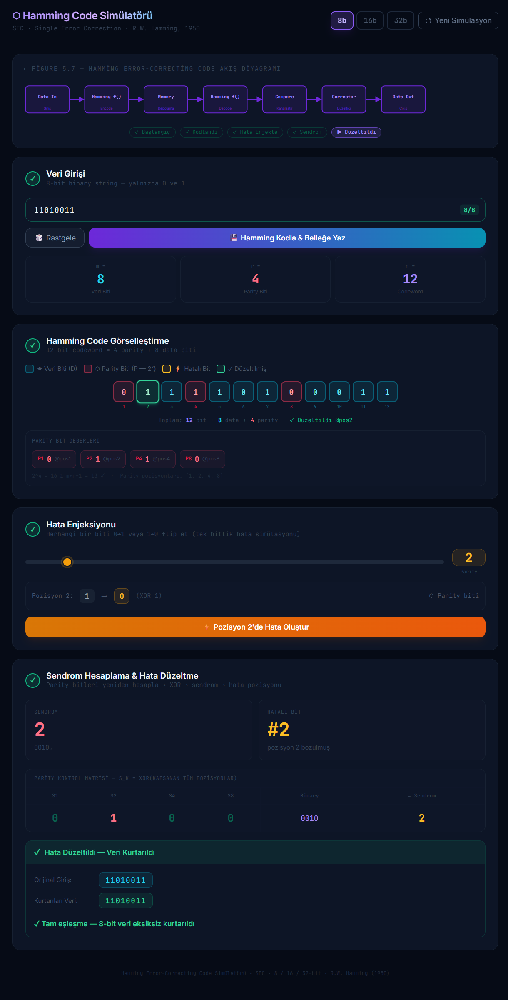

<h1 align="center">
  🔢 Hamming Hata Düzeltme Kodu Simülatörü
</h1>

<p align="center">
  <strong>Hamming (SEC-DED) hata düzeltme kodlarını görsel olarak anlamak için etkileşimli bir simülatör</strong>
</p>

<p align="center">
  <a href="https://barisyzici.github.io/hamming-code-simulator/">Canlı Demo</a>
</p>

<br/>



<br/>

---

## 📖 Hakkında

Bu proje, **BLM230 — Bilgisayar Mimarisi** dersi kapsamında geliştirilmiş, **Hamming Tek Hata Düzeltme / Çift Hata Tespit (SEC-DED)** kodlarını görselleştiren eğitici ve etkileşimli bir simülatördür.

İkili veriyi Hamming parite bitleriyle kodlayabilir, herhangi bir konuma bit-flip hatası enjekte edebilir ve **sendrom tabanlı tespit & düzeltme** algoritmasının hatalı biti adım adım nasıl bulup düzelttiğini temiz ve koyu temalı bir arayüzde izleyebilirsiniz.

---

## ✨ Özellikler

- 🧮 **Çoklu genişlik desteği** — 8-bit, 16-bit ve 32-bit veri kelimelerini kodlayın
- 🔴🔵 **Renk kodlu bit görselleştirme** — Parite bitleri **kırmızı**, veri bitleri **mavi**
- ⚡ **Gerçek zamanlı kodlama** — Hamming kod kelimesi anında üretilip gösterilir
- 💥 **Hata enjeksiyonu** — Herhangi bir bite tıklayarak iletim hatası simüle edin
- 🔍 **Sendrom hesaplama** — XOR tabanlı otomatik sendrom hesabıyla hatalı bit tespit edilir
- ✅ **Otomatik düzeltme** — Tek bitli hatalar düzeltilir; çift bitli hatalar işaretlenir
- 📊 **Şekil 5.7 akış diyagramı** — Kod çözme algoritmasını gösteren etkileşimli SVG diyagramı
- 🔔 **Toast bildirimleri** — Kodlama, hata tespiti ve düzeltme olaylarında anlık geri bildirim
- 🛡️ **Girdi doğrulama** — Geçersiz girişleri açıklayıcı hata mesajlarıyla engeller
- 🌙 **Koyu tema** — Uzun çalışma seansları için şık ve göz dostu arayüz

---

## Video

<p align="center">
  <a href="https://www.youtube.com/watch?v=oh1wg8sWNEA/">Demo Videosu</a>
</p>

---

## 📐 Hamming Kodu Teorisi

**Hamming kodları**, iletim veya depolama sırasında hataların tespit edilip düzeltilebilmesi için veri kelimesine fazladan parite bitleri ekler.

### Kaç Parite Biti Gerekir?

**m** bitlik bir veri kelimesi için gereken **r** parite biti sayısı şu koşulu sağlamalıdır:

$$2^r \geq m + r + 1$$

| Veri Biti (m) | Parite Biti (r) | Toplam Kod Kelimesi (m + r) |
|:---:|:---:|:---:|
| 8  | 4 | 12 |
| 16 | 5 | 21 |
| 32 | 6 | 38 |

### Parite Bit Konumları

Parite bitleri, kod kelimesinde **2'nin kuvveti** olan konumlara yerleştirilir (1, 2, 4, 8, 16, …). Her parite biti, o konumun ikili gösterimine göre belirlenen belirli veri biti konumlarını kapsar.

### Sendrom Tabanlı Hata Tespiti

Alınan kod kelimesi çözülürken:

1. Her parite biti kapsadığı konumlar üzerinden yeniden hesaplanır.
2. Sonuçlar ikili bir **sendrom** sözcüğü oluşturur.
3. Sendrom `0` ise hata yoktur.
4. **Sıfır olmayan sendrom**, doğrudan hatalı bitin **konumunu** kodlar.
5. **Çift bitli hata**, ek bir genel parite denetimiyle (SEC-DED) işaretlenir.

---

## 🗂️ Proje Dosya Yapısı

```
hamming-code-simulator/
├── public/
│   └── vite.svg
├── src/
│   ├── core/
│   │   ├── bitUtils.js          # Bit işleme yardımcı fonksiyonları
│   │   ├── hammingEncoder.js    # Kodlama mantığı: parite bit yerleşimi ve hesaplama
│   │   └── hammingDecoder.js    # Kod çözme mantığı: sendrom hesaplama ve düzeltme
│   ├── App.jsx                  # Ana uygulama bileşeni ve arayüz
│   └── main.jsx                 # React giriş noktası
├── assets/
├── hamming-test.mjs             # Bağımsız test / doğrulama betiği
├── index.html
├── package.json
├── vite.config.js
└── README.md
```

---

## 🎨 Renk Kodlaması Referansı

| Renk | Rol | Açıklama |
|:---:|:---|:---|
| 🔴 **Kırmızı** | Parite Biti | 2'nin kuvveti olan konumlara eklenen artıklık bitleri |
| 🔵 **Mavi** | Veri Biti | Kullanıcının girdiği orijinal veri bitleri |
| 🟡 **Sarı** | Hatalı Bit | Hata simüle etmek için çevrilen bit |
| 🟢 **Yeşil** | Düzeltilmiş Bit | Hatalı olduğu tespit edilip düzeltilen bit |

---

## 🏫 Ders Bilgileri

| Alan | Detay |
|:---|:---|
| **Ders** | BLM230 — Bilgisayar Mimarisi |
| **Konu** | Hata Tespiti ve Düzeltme (Hamming Kodları) |
| **Kaynak** | Patterson & Hennessy, *Computer Organization and Design* — Şekil 5.7 |

---

