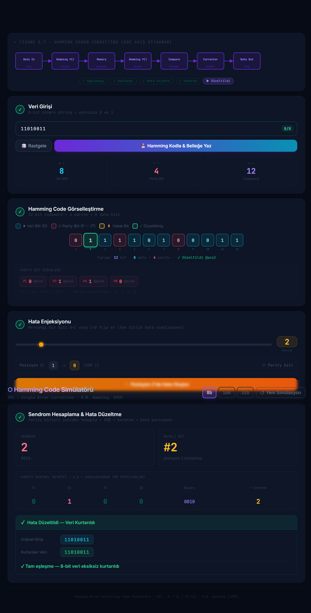

<h1 align="center">
  🔢 Hamming Error-Correcting Code Simulator
</h1>

<p align="center">
  <strong>An interactive, visual simulator for understanding Hamming (SEC-DED) error-correcting codes</strong>
</p>

<p align="center">
  <a href="https://reactjs.org/"></a>
  <a href="https://vitejs.dev/"></a>
  <a href="https://tailwindcss.com/"></a>
  <a href="LICENSE"></a>
  <a href="https://barisyzici.github.io/hamming-code-simulator/"></a>
</p>

<p align="center">
  <a href="https://barisyzici.github.io/hamming-code-simulator/">Live Demo</a>
</p>

<br/>



<br/>

<p align="center">
  <a href="https://barisyzici.github.io/hamming-code-simulator/">
    
  </a>
</p>

---

## 📖 About

This project is an educational, interactive simulator for **Hamming Single Error Correction, Double Error Detection (SEC-DED)** codes, built as a course project for **BLM230 — Computer Architecture**.

It allows you to encode binary data with Hamming parity bits, inject bit-flip errors at any position, and watch the **syndrome-based detection and correction** algorithm locate and fix errors automatically — all visualized step-by-step in a clean dark-themed UI.

---

## ✨ Features

- 🧮 **Multi-width support** — Encode 8-bit, 16-bit, and 32-bit data words
- 🔴🔵 **Color-coded bit visualization** — Parity bits in **red**, data bits in **blue** for instant clarity
- ⚡ **Real-time encoding** — Hamming codeword generated and displayed immediately
- 💥 **Error injection** — Click any bit to flip it and simulate a transmission error
- 🔍 **Syndrome computation** — Automatic XOR-based syndrome calculation pinpoints the faulty bit
- ✅ **Auto-correction** — Single-bit errors detected and corrected; double-bit errors flagged
- 📊 **Figure 5.7 flow diagram** — Interactive SVG flowchart illustrating the decoding algorithm
- 🔔 **Toast notifications** — Instant feedback for encoding, error detection, and correction events
- 🛡️ **Input validation** — Prevents invalid inputs with descriptive error messages
- 🌙 **Dark theme** — Sleek, eye-friendly dark UI designed for extended study sessions

---

## 🚀 Getting Started

### Prerequisites

- [Node.js](https://nodejs.org/) v18 or higher
- npm v9 or higher

### Installation

```bash
# 1. Clone the repository
git clone https://github.com/barisyzici/hamming-code-simulator.git

# 2. Navigate to the project directory
cd hamming-code-simulator

# 3. Install dependencies
npm install

# 4. Start the development server
npm run dev
```

Open [http://localhost:5173](http://localhost:5173) in your browser to use the simulator.

### Build for Production

```bash
npm run build
```

The production-ready output will be in the `dist/` directory.

### Deploy to GitHub Pages

```bash
npm run deploy
```

---

## 📐 Hamming Code Theory

**Hamming codes** add redundant parity bits to a data word so that errors can be detected and corrected during transmission or storage.

### How Many Parity Bits Are Needed?

Given a data word of **m** bits, the number of required parity bits **r** satisfies:

$$2^r \geq m + r + 1$$

| Data Bits (m) | Parity Bits (r) | Total Codeword Length (m + r) |
|:---:|:---:|:---:|
| 8  | 4 | 12 |
| 16 | 5 | 21 |
| 32 | 6 | 38 |

### Parity Bit Positions

Parity bits occupy positions that are **powers of 2** in the codeword (1, 2, 4, 8, 16, …). Each parity bit covers a specific subset of data bit positions determined by the binary representation of those positions.

### Syndrome-Based Error Detection

When the received codeword is decoded:

1. Each parity bit is re-computed over its covered positions.
2. The results form a binary **syndrome** word.
3. A syndrome of `0` means no error.
4. A **non-zero syndrome** directly encodes the **position** of the erroneous bit.
5. A **double-bit error** is flagged via an additional overall parity check (SEC-DED).

---

## 🗂️ Project Structure

```
hamming-code-simulator/
├── public/
│   └── vite.svg
├── src/
│   ├── core/
│   │   ├── bitUtils.js          # Bit manipulation helpers
│   │   ├── hammingEncoder.js    # Encoding logic: parity bit placement & calculation
│   │   └── hammingDecoder.js    # Decoding logic: syndrome computation & correction
│   ├── App.jsx                  # Main application component & UI
│   └── main.jsx                 # React entry point
├── assets/
├── hamming-test.mjs             # Standalone test/validation script
├── index.html
├── package.json
├── vite.config.js
└── README.md
```

---

## 🎨 Color Coding Reference

| Color | Role | Description |
|:---:|:---|:---|
| 🔴 **Red** | Parity Bit | Redundancy bits inserted at power-of-2 positions |
| 🔵 **Blue** | Data Bit | Original data bits from the user's input |
| 🟡 **Yellow** | Error Bit | A bit that has been flipped to simulate an error |
| 🟢 **Green** | Corrected Bit | A bit that was erroneous and has been corrected |

---

## 🏫 Course Information

| Field | Detail |
|:---|:---|
| **Course** | BLM230 — Computer Architecture |
| **Topic** | Error Detection and Correction (Hamming Codes) |
| **Reference** | Patterson & Hennessy, *Computer Organization and Design* — Figure 5.7 |

---

